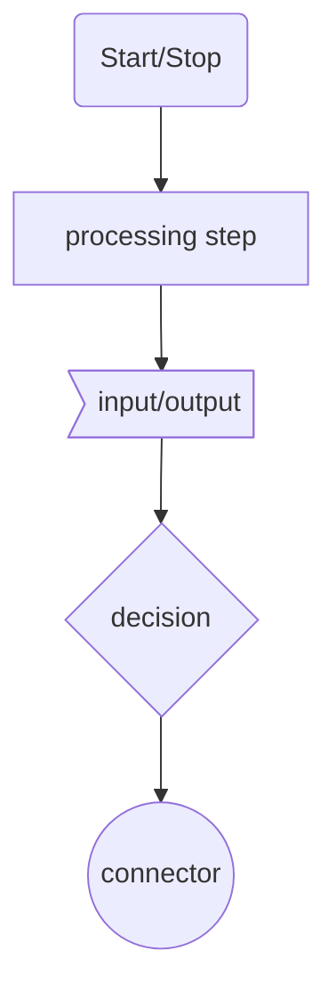

# RB101 Quick Notes
[github repo](https://github.com/Monte-Amador/rb101-foundations)

- `.inspect` is handy to see what is happening with an object

- Debugging: This type of assignment, where we assign more than one value on the same line, is called "multiple assignment".

- Precedence: 
  In short, precedence determines the meaning of an expression.
  Another way to think of precedence is that it controls the order of evaluation. Operations involving operators with high precedence get evaluated before operations involving low precedence. When two operations involve operators of the same precedence, the operations occur left\-to\-right (or right\-to\-left in some cases). **However**, thinking of precedence in this way can sometimes lead to unexpected results when using the `||` and `&&` short\-circuit operators or the ternary operator (`a ? b : c`). It's safer to think of precedence as the mechanism used by Ruby to determine which operands get passed to each operator.


## Misc extending lesson flowchart tool
Mermaid Syntax: 




## Review Styles, Concepts, Syntax or Logic
--------------------------------------------
### Pseudo Code

> When you first approach any problem, it's important to try to understand it well. In order to do that, you have to spend time to load the problem into your brain. Only then can you start to dissect it, understand it, and come up with an execution path to solve it.

> Therefore, there are two layers to solving any problem:
> 1. The logical problem domain layer.
> 2. The syntactical programming language layer.

> -- <cite>[Pseudo-Code](https://launchschool.com/lessons/a0f3cd44/assignments/18adce3e)</cite>

***

> We'll use the below keywords to assist us, along with their meaning.

| keyword | meaning |
| --- | --- |
| START | start of the program |
| SET | sets a variable we can use for later |
| GET | retrieve input from user |
| PRINT | displays output to user |
| READ | retrieve value from variable |
| IF / ELSE IF / ELSE | show conditional branches in logic |
| WHILE | show looping logic |
| END | end of the program |

### [Flowchart](https://launchschool.com/lessons/a0f3cd44/assignments/cfbf3863)

Come back to this and review the logic that they explain thoroughly. It's a new approach so best to take this one in a piecemeal style
> The interesting part about this flowchart is the processing square in the middle num = find_largest(collection). This is our sub-process. You can think of this square as the zoomed-out high level view of the very first flowchart from the top of this assignment.

> Interestingly, when we move logic to sub-processes, we are able to use a declarative type of syntax, rather than imperative. 

> -- <cite>[Flowchart](https://launchschool.com/lessons/a0f3cd44/assignments/cfbf3863)</cite>

***

### [Debugging](https://launchschool.com/lessons/a0f3cd44/assignments/e742d62a)

In summary, debugging is arguably the most important skill you need to learn as a programmer. Focus on developing a patient, systematic temperament; carefully read error messages; use all the wonderful resources at your disposal; approach debugging in sequential steps; and use the techniques we covered above \-\- especially Pry. If you haven't yet, go install Pry now and play around with it a little bit.

Steps to Debugging:
1. Reproduce The Error: 
The first step in debugging any problem is usually reproducing the problem. Programmers need a deterministic way to consistently reproduce the problem, and only then can we start to isolate the root cause. There's an old joke where programmers will say "works on my machine" because they can't reproduce an error that occurs in the production environment. This will become more important as you build more sophisticated applications with various external dependencies and moving parts. Reproducing the exact error will often end up being more than half the battle in many tricky situations.

2. Determine The Boundaries Of The Error: 
Once you can consistently reproduce the problem, it's time to tweak the data that caused the error. For example, the stack trace earlier was generated by this code post.categories << news. Does calling post.categories cause issues? What about just calling post? What happens if we try to append a different object, like this: post.categories << sports? How does modifying the data affect the program behavior? Do we get expected errors, or does a new error occur that sheds light on the underlying problem?

What we're trying to do is modify the data or code to get an idea of the scope of the error and determine the boundaries of the problem. This will lead to a deeper understanding of the problem, and allow us to implement a better solution. Most problems can be solved in many ways, and the deeper you understand the problem, the more holistic solution you can come up with.

3. Trace the Route:
Once you understand the boundaries of the problem, it's time to trace the code. Let's use a new example.

```
def car(new_car)
  make = make(new_car)
  model = model(new_car)
  [make, model]
end

def make(new_car)
  new_car.split(" ")[0]
end

def model(new_car)
  new_car.split(" ")[2]
end

make, model = car("Ford Mustang")
make == "Ford"         # => true
model.start_with?("M") # => NoMethodError: undefined method `start_with?' for nil:NilClass

```

This code is fairly straightforward. One aspect of it that's a bit tricky is the return value of the `car` method and the assignment from that method to local variables `make` and `model`. When an array is assigned to two variables on the same line, each element of that array gets assigned to one of the variables. In the example above, the first array element gets assigned to `make` and the second array element gets assigned to `model`. This type of assignment, where we assign more than one value on the same line, is called "multiple assignment".

When we try to see if `model` starts with the character `"M"`, we get an error. After reproducing the problem consistently and testing various data inputs, you notice that `model` always returns `nil`. In this example, `make` is expected to be `"Ford"` and `model` is expected to be `"Mustang"`. It looks like we've got a bug here.

Let's trace the code backwards. When you first call `car`, a string is passed in as an argument. The string represented by the local variable `new_car` is passed into two helper methods: `make` and `model`. Inside each of these methods, the intention is to split `new_car` into two new strings: `"Ford"` and `"Mustang"`. The `make` method should return `"Ford"` and the `model` method should return `"Mustang"`. In this case, the `make` method returns the correct value but the `model` method does not. Based on these observations, we know that the bug in this code originates from the `model` method. This is called *trapping the error*.

4. Understand The Problem Well:
After narrowing the source of the bug to the `model` method, it's time to break down the code within the method. We know that the return value of this method is always `nil`, so let's inspect each return value in order to pinpoint the source of the unexpected return value.

```
def model(new_car)
  new_car # => "Ford Mustang"
end

```
That's the expected return value of new_car. No issues so far.

```
def model(new_car)
  new_car.split(" ") # => ["Ford", "Mustang"]
end

```
The return value here is an array, which is expected based on our knowledge of how `#split` works.

```
def model(new_car)
  new_car.split(" ")[2] # => nil
end

```
Aha! It looks like the unexpected return value here is the result of calling `[2]` on the `["Ford", "Mustang"]` array. The return value is `nil` because there is no element at index `2` in this array. Since arrays have a zero\-based index, we need to call `[1]` in order to return `"Mustang"` from the array.

5. Implement a Fix:
There are often multiple ways and multiple layers in which you can make the fix. For example, we could suppress the error from being thrown with this code:

```
model.start_with?("M") rescue false # => false

```

We'll still have the original error in the `model` method, though. In some cases, you'll be using a library or code that you can't modify. In those situations, you have no choice but to deal with edge cases in your own code. In this example, we should fix the offending code in the `model` method.

One very important note is to fix *one problem at a time*. It's common to notice additional edge cases or problems as you're implementing a fix. Resist the urge to fix multiple problems at once.

You'll almost never want to use the trailing `rescue` like we did in the above example. It's usually a **code smell** that you haven't thought carefully about the possible problems that could go wrong, and therefore you haven't thought about how to handle the potential error conditions. Also, by not specifying any particular error to rescue, you're suppressing all possible errors, including potentially very destructive ones that may impact your program in unexpected ways.

6. Test the Fix:
Finally, after implementing a fix, make sure to verify that the code fixed the problem by using a similar set of tests from step #2. After you learn about automated testing, you'll want to add an additional automated test to prevent regression. For now, you can test manually.

### [Precedence](https://launchschool.com/lessons/a0f3cd44/assignments/f76e5b21)

The last 1/3 was a lot to take in specifically with the `.tap` object instance method. Revisit the way it was described although the debugging part of it seemed to make more sense for me.

### Evaluation Order

From time to time, you may hear or read somebody saying that precedence determines the order in which expressions get evaluated. The evaluation process is more complicated than just determining what gets evaluated first, though. In fact, precedence in Ruby is only part of the story; the other parts are either left\-to\-right evaluation, right\-to\-left evaluation, short\-circuiting, and ternary expressions.