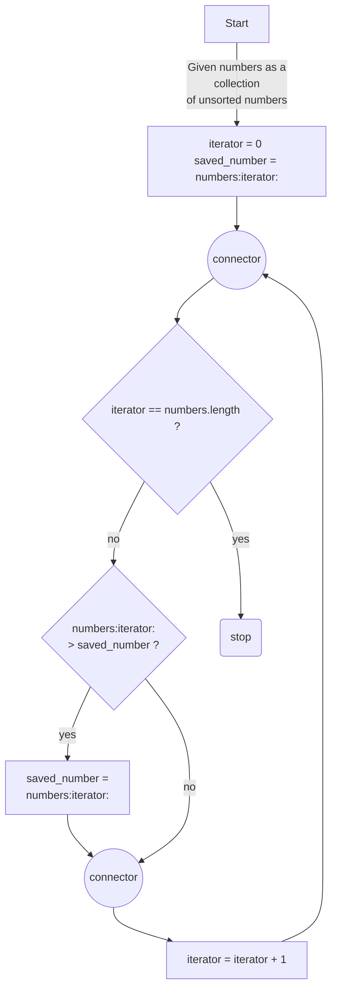

```mermaid
graph TD
1[Start] -->|Given numbers as a</br>collection</br>of unsorted numbers| 2:[iterator = 0 </br>saved_number = numbers:iterator:]
2:[iterator = 0 </br>saved_number = numbers:iterator:]--> 3((connector))
3((connector)) --> 4{iterator == numbers.length ?}
4{iterator == numbers.length ?} -->|yes| 4.1(stop)
4{iterator == numbers.length ?} -->|no| 5{numbers:iterator:</br> > saved_number ?}
5{numbers:iterator:</br> > saved_number ?} -->|yes| 5.1[saved_number =</br>numbers:iterator:]
  5.1[saved_number =</br>numbers:iterator:] --> 6((connector))
5{numbers:iterator:</br> > saved_number ?} -->|no| 6((connector))
6((connector)) --> 7[iterator = iterator + 1] --> 3((connector))

```